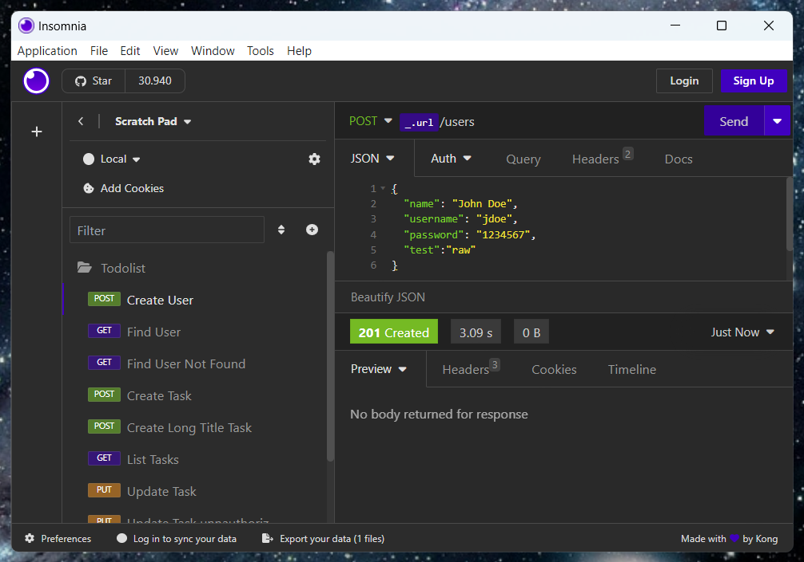

<h1 align="center">todolist ☕</h1>

<p align="center">Back-end application focused on task management ensuring that only the task owners can manage them through a basic authorization flow.</p>

<p align="center">
     <a alt="Java">
        
    </a>
    <a alt="Spring Boot">
        
    </a>
    <a alt="Maven">
        
    </a>
    <a alt="H2 ">
        
    </a>
    <a alt="Lombok">
        
    </a>
    <a alt="Bcrypt">
        
    </a>
    <a alt="Visits">
        
    </a>
</p>

<div align="center">
    
</div>

<details>
  <summary>Table of Contents</summary>
  <ol>
    <li><a href="#idea">Idea</a></li>
    <li><a href="#how-to-run">How to run</a></li>
    <li><a href="#how-to-develop">How to develop</a></li>
    <li><a href="#collection">Collection</a></li>
    <li><a href="#references">References</a></li>
  </ol>
</details>

## Idea
- Create users using bcrypt hashing to mask user password on database.
  - Users must have unique usernames
- It's important to filter user credentials just for tasks requests.
  - This data will be sent in authorization header, where the basic authorization mode is used.
  - Tasks must have in maximum titles with 50 characters.

## How to run

### Step 1 - Prerequisite to run
- [Docker](https://www.docker.com/get-started/)

### Step 2 - Image 🖼️
Go inside the project root and create the application image based on Dockerfile
```
docker build -t todolist
```

### Step 3 - Run 🏃‍♂️
After the command execution
```
docker run -e DB_USERNAME=<username> -e DB_PASSWORD=<password> -p 8080:8080 todolist
```

That's all! 🎉

## How to develop

### Step 1 - Prerequisite to develop
- Java 17 of your preference (I just use one of IntelliJ suggest me)
- Configure the variables in your environment.
    ```
    DB_USERNAME=<username>
    DB_PASSWORD=<password>
    ```
> **Obs**: You can just set the environment variables in your running configuration if you're using an IDE that have this feature.

### Step 2 - Clonning 👥

```
git clone https://github.com/barreto/todolist.git
```

### Step 3 - Run 🏎️
By command line (if you have mvn configured on PATH)
```
mvn spring-boot:run
```

Or you can find the "Play" button in your IDE.

That's it! 🎊

## Collection
[


](./docs/assets/Todolist-Insomnia_2023-10-15)

## References
- **Thanking**
  - This project was built during the pre-launch of the Java course track on [Rocketseat ONE](https://www.rocketseat.com.br/one) by [Daniele Leão](https://github.com/danileao).

- **Original structure**
  - [Base structure on Spring Initializr](https://start.spring.io/#!type=maven-project&language=java&platformVersion=3.0.11&packaging=jar&jvmVersion=17&groupId=com&artifactId=todolist&name=todolist&description=Task%20manager&packageName=com.todolist&dependencies=web)
- **Oficial docs**:
  - [Spring Boot H2 Database](https://www.javatpoint.com/spring-boot-h2-database)
  - [Project Lombok - Maven](https://projectlombok.org/setup/maven)
  - [bcrypt by patrickfav](https://github.com/patrickfav/bcrypt)

---
<h6 align="center">Thanks ❤️‍🔥</h6>

---

<p align="right"><a href="#todolist-">back to top ↑</a></p>
